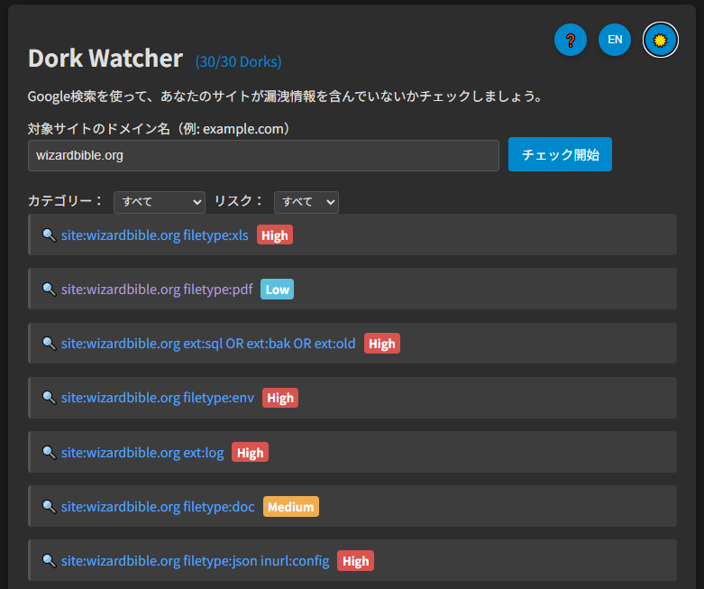

# Dork Watcher

**Day020 - 生成AIで作るセキュリティツール100**

**Dork Watcher**は、Google Dorkを使って自サイトに潜在的な情報漏洩がないか確認するためのツールです。

## 🔍 デモページ

👉 [https://ipusiron.github.io/dork-watcher/](https://ipusiron.github.io/dork-watcher/)

## ❓ Dorkとは？

「Dork（ドーク）」は、検索エンジンを使って意図せず公開されている機密情報を見つけ出すための検索式です。  
元々の意味は「まぬけ」ですが、セキュリティ界隈では漏洩情報を探し当てる「高度な検索クエリ」として知られています。

## 📸 スクリーンショット

> 

## 📄 ライセンス

MIT License - 詳細は [LICENSE](LICENSE) をご覧ください。
