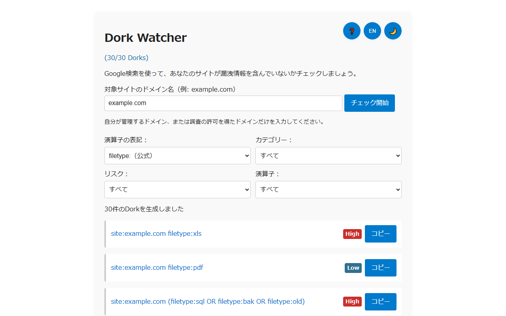
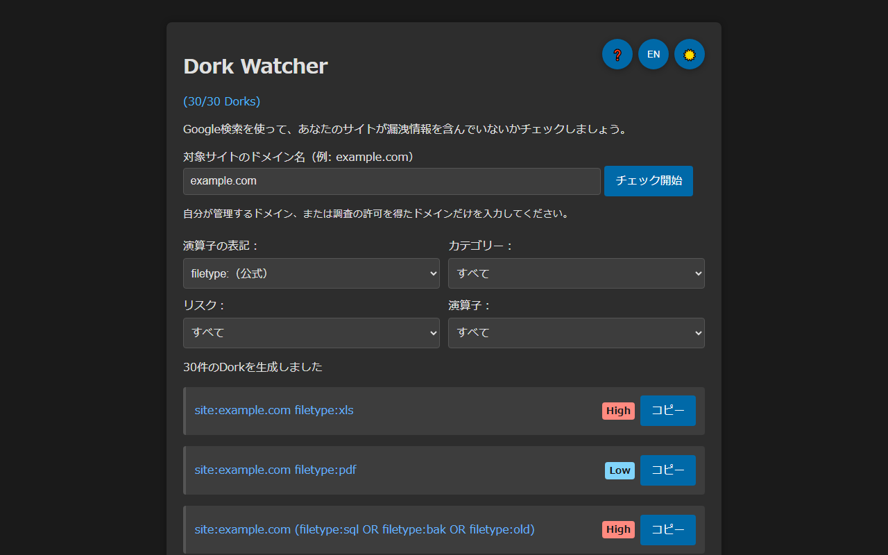
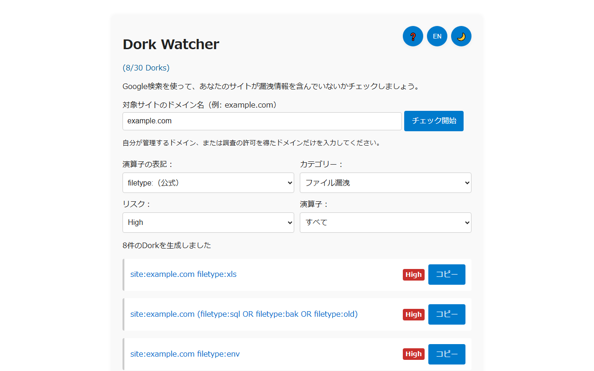
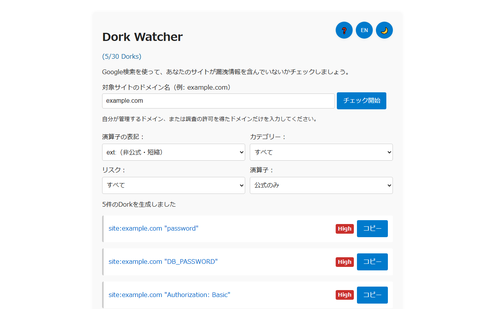
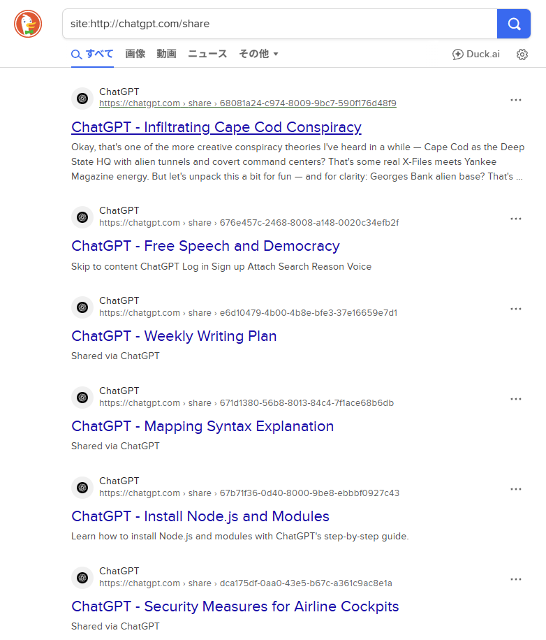

<!--
---
id: day020
slug: dork-watcher

title: "Dork Watcher"

subtitle_ja: "Google Hacking支援ツール"
subtitle_en: "Google Hacking Assistant Tool"

description_ja: "Google Dorkを使って自サイトに潜在的な情報漏洩がないか確認するためのツール"
description_en: "A tool to check your site for potential information leaks using Google Dorks"

category_ja:
  - OSINT
  - Googleハッキング
category_en:
  - OSINT
  - Google Hacking

difficulty: 1

tags:
  - google-dork
  - osint
  - information-leak
  - security-audit
  - web-security

repo_url: "https://github.com/ipusiron/dork-watcher"
demo_url: "https://ipusiron.github.io/dork-watcher/"

hub: true
---
-->

# Dork Watcher - Google Hacking支援ツール


[](https://ipusiron.github.io/dork-watcher/)

**Day020 - 生成AIで作るセキュリティツール100**

**Dork Watcher**は、Google Dorkを使って自サイトに潜在的な情報漏洩がないか確認するためのツールです。
30件の検索式を生成し、カテゴリー・リスク・演算子で絞り込めます。
`filetype:`と`ext:`の表記を切り替え、文書化された演算子と非公式演算子の違いを学べます。

---

## 🌐 デモページ

👉 [https://ipusiron.github.io/dork-watcher/](https://ipusiron.github.io/dork-watcher/)

---

## 📸 スクリーンショット


> *example.comを対象に30件のDorkを生成した状態*


> *同じ30件をダークテーマで表示した状態*


> *カテゴリー「ファイル漏洩」とリスク「High」で8件に絞り込んだ状態*


> *ext:表記で「公式のみ」にすると、引用符だけで書かれた5件が残る*

---

## 🔍 Google Hacking

**Google Hacking（グーグル・ハッキング）** とは、検索エンジン（主にGoogle）を使って、**意図せず公開されている機密情報や設定ミス、脆弱なファイルなどを探し出す手法** です。  
これは悪用を目的とした攻撃手法としてだけでなく、セキュリティ診断やOSINT（オープンソース情報収集）においても正当な目的で活用されます。  

---
## ❓ Dorkとは？

このときに使われる検索クエリが、いわゆる **Google Dork（グーグル・ドーク）** です。

**Dork（ドーク）** とは、検索オプション（例：`filetype:`, `inurl:`, `intitle:` など）を組み合わせて、特定の情報を効率的に探すための検索式のことです。

この言葉には皮肉を込めた由来があります。

> 「こんなものを公開したままにしているなんて、まぬけ（dork）だ」

実際、セキュリティ研究者であるJohnny Long氏は2002年に[Google Hacking Database (GHDB)](https://www.exploit-db.com/google-hacking-database)を公開し、数千件以上のDorkを体系化しました。
現在でもセキュリティ教育・調査・CTFなどにおいて活用されています。

本ツール「Dork Watcher」は、このようなGoogle Dorkを使って、**自分の管理するサイトに潜在的なリスクがないかを簡易的にチェックする** ための支援ツールです。

### 💡 他の検索エンジンでも使えるか

Dorkは「Google Dork」と呼ばれていますが、DuckDuckGo（DDG）やBingなど他の検索エンジンでも一部構文は有効です。  
ただし、インデックスされる内容・件数・精度は異なるため、検出できる情報の傾向も変わります。

2025年8月のニュースでは、ChatGPTの共有リンク（Share link）機能を使ったページがDuckDuckGoに大量インデックスされたという出来事が報じられました。
たとえば、以下のDorkによって、インデックスされた共有リンクを列挙できました。

```
site:chatgpt.com/share
```

> 
>
> *DuckDuckGoでChatGPT共有リンクを検索したところ*

DuckDuckGoのほうが早く・多く・長期間にわたりそれらを表示してしまい、プライバシー重視のはずの検索エンジンが皮肉にも「最大の漏洩源」になってしまったのです。
これはDuckDuckGoのインデックスポリシーとクロールの緩さが原因です。

| 比較項目        | Google   | DuckDuckGo   |
| ----------- | -------- | ------------ |
| Dork構文のサポート | ◎（使える演算子が最も多い。ただし公式に文書化されているのは一部） | ◯（基本構文のみ）    |
| インデックス精度    | ◎（最大規模）  | △（Bingベース）   |
| 漏洩検出性能      | 高（除外も多い） | 中（削除が遅れる）    |
| プライバシー配慮    | 検索履歴あり   | ✅ 検索履歴を保存しない |

---

## 🧰 主な機能一覧

- Google Dork一覧自動生成（30件）
- カテゴリー・リスク・演算子による3軸の絞り込み
- 検索リンクのワンクリック生成（Googleで即調査）
- 演算子の表記の切り替え（`filetype:` ⇔ `ext:`）
- クエリのコピー（URLではなく検索式をコピー）
- ドメイン名の正規化と検証（URLからのホスト抽出・IDNのpunycode変換）
- ヘルプモーダル（使い方・注意点をわかりやすく案内）
- ダークモード切り替え対応
- 結果件数のリアルタイム表示

---

## 📖 使い方

1. 自分が管理するドメイン、または調査の許可を得たドメインを入力する。
2. 「チェック開始」ボタンまたは入力欄のEnterキーで、検索リンクを生成する。
3. 「演算子の表記」と3軸のフィルターを選び、必要な検索式だけを表示する。
4. 1件ずつリンクを開いて検索結果を確認する。検索式を保存する場合は行の「コピー」を使う。

URLを入力しても、検索対象にはホスト名だけを使います。
たとえば`https://example.com/path`は`example.com`、`日本語.jp`は`xn--wgv71a119e.jp`になります。
空白や検索演算子を含む入力、IPアドレス、形式の不正なドメインは受け付けません。
Googleの`site:`自体はURLプレフィックスも扱えますが、このツールではドメイン単位の検索に統一しています。

コピーにはブラウザーのClipboard APIを使います。
ブラウザーの権限や実行環境によって拒否された場合は画面に通知します。

## 🔤 公式演算子と非公式演算子

ここでいう「公式」は、[Google検索ヘルプの演算子一覧](https://support.google.com/websearch/answer/2466433?hl=ja)に載っている6種類を指します。
説明と例が公開されているため、仕様変更も確認しやすくなります。
一覧にない演算子も広く利用されていますが、現在の動作や将来の継続を保証するものではありません。

**Dorkが空振りしたとき、「サイトが安全だから」なのか「演算子が効かなくなったから」なのかを切り分けるために、この区別を知っておく必要があります。**

### 演算子の一覧

| 演算子 | 区分 | はたらき | 本ツールでの使用 |
| --- | --- | --- | --- |
| `site:` | 公式 | 指定したドメイン・URLプレフィックスに絞る | 全30件に前置 |
| `filetype:` | 公式 | 指定したファイル形式・拡張子に絞る | 12件 |
| `""` | 公式 | 完全一致 | 12件 |
| `-` | 公式 | 語を除外する | 未使用 |
| `before:` ／ `after:` | 公式 | 日付で絞る | 未使用 |
| `ext:` | 非公式 | `filetype:`の別名として広く使われる | 表記を切り替えると12件 |
| `inurl:` | 非公式 | URLに語を含む | 9件 |
| `intitle:` | 非公式 | タイトルに語を含む | 5件 |
| `intext:` | 非公式 | 本文に語を含む | 1件 |
| `allintext:` ／ `allintitle:` ／ `allinurl:` | 非公式 | 続く語をすべて含む。ほかの演算子と併用すると結果が不安定になる | 使わない |

本ツールは`site:`を必ず前置するため、併用時の不安定さを避ける方針で`allin`系を使いません。
管理用の語は`intext:admin intext:login`のように演算子を2つ並べます。
`"Authorization: Basic"`のような引用符内のコロンは、演算子として数えません。

`site:`と`filetype:`の詳細は、[検索セントラルのsite:ドキュメント](https://developers.google.com/search/docs/monitor-debug/search-operators/all-search-site?hl=ja)と[filetype:の説明](https://developers.google.com/search/docs/monitor-debug/search-operators?hl=ja#filetype)で確認できます。
`filetype:`はURL末尾だけでなく、Content-Typeによるファイル形式も対象にします。

### 自分で確かめる方法

画面の「演算子の表記」を`filetype:`から`ext:`へ切り替えると、同じ狙いの検索式を両方の書き方で生成できます。
「公式のみ」で絞ったときの件数は15件から5件へ変わります。
許可されたドメインについて2つのリンクを1件ずつ開き、結果が同じかどうかを確認してください。
本ツールは検索結果を自動取得せず、演算子の有効性も自動判定しません。

| 表記 | 公式のみ | 非公式を含む |
| --- | --- | --- |
| `filetype:`（既定） | 15 | 15 |
| `ext:` | 5 | 25 |

`ext:`表記でも公式のままなのは、引用符しか使っていない5件です。
対象は`"password"`・`"DB_PASSWORD"`・`"Authorization: Basic"`・`"confidential"`・`"private key"`です。

### カテゴリーごとの偏り

管理系の9件は、現在収録している検索式では公式の演算子だけで1件も書けません。
`inurl:`・`intitle:`・`intext:`を使うためです。
逆に情報ワードの7件は、`filetype:`表記ならすべて公式で書けます。
何を探すかによって、頼る演算子も変わります。

| カテゴリー | 件数 | 公式のみ | 非公式を含む |
| --- | --- | --- | --- |
| ファイル漏洩 | 10 | 7 | 3 |
| 管理系 | 9 | 0 | 9 |
| 情報ワード | 7 | 7 | 0 |
| その他 | 4 | 1 | 3 |
| 合計 | 30 | 15 | 15 |

## 🧰 収録しているDork

| カテゴリー | 件数 | High | Medium | Low |
| --- | --- | --- | --- | --- |
| ファイル漏洩 | 10 | 8 | 1 | 1 |
| 管理系 | 9 | 1 | 8 | 0 |
| 情報ワード | 7 | 7 | 0 | 0 |
| その他 | 4 | 2 | 1 | 1 |
| 合計 | 30 | 18 | 10 | 2 |

基準の`filetype:`表記では、公式の演算子だけで書けるDorkが15件、非公式演算子を含むものが15件です。
後者には画面で「非公式」ラベルが付きます。
表記を変えると、その検索式に応じてラベルと絞り込み結果も更新されます。

## 🔧 フィルター機能

Dork Watcherでは、複数のDorkクエリの中から、必要なものだけを絞り込んで表示するためのフィルター機能を搭載しています。

### 📂 カテゴリー別フィルター
Dorkは以下の4つのカテゴリーに分類されています。

- **ファイル漏洩**：`.env`や`.sql`などの重要ファイルが誤って公開されていないか
- **管理系**：ログインページや管理画面の露出を検出
- **情報ワード**：パスワードやAPIキーなど、内部情報の含有可能性があるもの
- **その他**：ディレクトリリスティング、テストページなど

### ⚠️ リスクレベルフィルター
各Dorkには危険度に応じたリスクレベル（High / Medium / Low）が設定されており、絞り込みが可能です。

- **High**：機密情報の漏洩に直結する可能性が高い  
- **Medium**：セキュリティ上の注意が必要な情報  
- **Low**：一般的だが確認が推奨される情報

### 🔤 演算子フィルター

「すべて」「公式のみ」「非公式を含む」の3種類があります。
分類は固定の属性ではなく、表記を適用したあとの検索式で判定します。

### 🔁 複合フィルターも可能

カテゴリー・リスク・演算子の3軸はANDで適用されます。
たとえば「ファイル漏洩」かつ「High」かつ「公式のみ」の組み合わせで絞り込めます。
3つをどの順に選んでも結果は同じです。

組み合わせによって0件になることもあります。
`ext:`表記＋「公式のみ」＋「ファイル漏洩」は0件で、これは正常な動作です。
---

## 🧯 ヒットしたときの対処

1. **まず塞ぐ**：該当のファイルやページを公開領域から外す。すぐに外せなければ認証やIP制限をかける。
2. **漏れた前提で動く**：パスワード・APIキー・トークン・秘密鍵が含まれていたら、無効にして発行し直す。ファイルを消しただけでは足りない。
3. **検索結果から消す**：Search Consoleの「非表示ツール」で一時的に隠し、公開を終えたURLには404または410を返す。
4. **原因を直す**：デプロイ手順、バックアップの置き場所、ディレクトリリスティングの設定を確認し、再発を防ぐ。

検索エンジンに載っていた情報は、第三者が取得できる状態だったと考える必要があります。
削除するだけでなく、認証情報の再発行を先に進めてください。

Googleの[非表示ツールとセーフサーチレポートツール](https://support.google.com/webmasters/answer/9689846?hl=ja)による一時ブロックは約6か月です。
恒久的に削除する場合は、サーバー側でコンテンツを外して404または410を返すなどの追加措置が必要です。
認証によるアクセス制限も選択肢ですが、**robots.txtをブロックの手段に使わないでください。**
robots.txt自体は誰でも読めるため、隠したい場所を公表することにもなります。

| カテゴリー | よくある原因 | 対処の要点 |
| --- | --- | --- |
| ファイル漏洩 | バックアップや設定ファイルを公開ディレクトリーに置いた | ファイルを外す→認証情報を発行し直す→置き場所とデプロイ手順を見直す |
| 管理系 | 管理画面のURLが検索エンジンに載っている | 掲載だけで直ちに脆弱性とはいえない。IP制限・追加の認証・多要素認証・noindexを検討する |
| 情報ワード | 本文に機微な語が含まれる | 解説記事などのノイズか、実物の認証情報かを確認する。実物なら発行し直す |
| その他 | リスティングが有効、phpinfo()やテストページの置き忘れ | Apacheは`Options -Indexes`、nginxは`autoindex off`。不要なページを削除する |

## ⚠️ ご利用にあたっての留意事項

本ツールは「Google Dork」を用いて、**意図しない情報公開が行われていないかを確認する支援** を目的としています。

ただし、以下の点にご留意ください。

- 🔍 **多くのケースでは、検索してもヒットしないのが正常です。**  
  セキュリティ意識の高いサイトでは、漏洩につながるファイルや情報は適切に非公開化されています。  
  また、Google自体もセキュリティの観点から、以下のような検索結果の制限・除外が生じることがあります。

  - クロール可能なページの`noindex`指定による除外（robots.txtだけでは検索結果からの削除を保証しない）
  - `.git` や `.env`、`passwd` など、意図しない機密ファイルへの直接リンクの除外  
  - ユーザー報告や自動検出に基づくインデックス削除

- 🔁 **Google検索の仕様は随時変更されています。**  
  かつて有効だったDork（例：`intitle:"index of"`、`inurl:admin` など）が現在では効果を発揮しにくいこともあります。  
  また、複雑な検索式や自動化されたクエリが繰り返されると、GoogleからBOTとして検出されてしまい、一時的に検索制限がかかることもあります。

- 📄 **「password」など一般的なキーワードはノイズを多く含みます。**  
  実際のパスワード漏洩ではなく、ブログ記事・マニュアル・セキュリティ解説などのページがヒットすることがあります。

- 🛡 **ヒットしないことは「安全」の証とは限りません。**  
  Googleにインデックスされていない領域（たとえば認証付きページや、検索エンジンブロック設定）に、漏洩情報が存在している可能性もあります。

- 🧪 **このツールはあくまで簡易的なチェックツールです。**  
  網羅的な脆弱性診断やペネトレーションテストの代替にはなりません。  
  より詳細な調査が必要な場合は、専門の診断サービスやOSINTツールの利用をご検討ください。

- 🧭 **調査対象は、自分の管理下にあるドメインや許可を得たサイトに限定してください。**  
  他人のサイトに対する情報収集やDork検索を行うことは、不正アクセス行為やプライバシー侵害に該当する可能性があります。

---

## 🔒 セキュリティ

ドメインをURLとして解析し、ホスト名・ラベル長・TLDの形式を検証します。
検索演算子や空白を混ぜた入力は拒否し、入力由来の注記はtextContentで表示します。
スクリプト・スタイル・アイコンは同梱し、ページの読み込みと検索式の生成による外部通信はありません。
検索リンクを利用者が開いたときは、Googleへ検索式が送信されます。

CSPは`script-src 'self'`・`style-src 'self'`・`connect-src 'none'`を含み、インラインスクリプトや外部通信を制限します。
referrerは`no-referrer`、別タブで開くリンクは`rel="noopener noreferrer"`です。
metaでは`frame-ancestors`が適用されないため、埋め込み拒否は保証しません。
localStorageに保存するのはテーマ・言語・演算子の表記だけです。
保存が禁止された環境でも、そのページの操作は継続できます。

## 🧪 テスト

Node 22以上で、依存パッケージをインストールせずに実行できます。

```sh
npm test
```

ドメイン正規化24例、30件のクエリ、各フィルターの件数、配色、HTML、READMEの表・画像・全ファイル一覧を検証します。
GitHub Actionsでもpushとpull_requestのたびに同じテストを実行します。

## 📁 ディレクトリー構造

```text
dork-watcher/                     # Google Dorkで自サイトの情報漏洩を確認するツール
├── .github/                      # GitHubの設定
│   └── workflows/                # GitHub Actionsのワークフロー
│       └── test.yml              # pushとpull_requestでnpm testを実行
├── .gitignore                    # Git管理から除外するファイルの指定
├── .nojekyll                     # PagesのJekyll処理を無効化
├── assets/                       # READMEに載せる画像とサイトアイコン
│   ├── ddg_chatgpt_share.png     # DuckDuckGoでChatGPT共有リンクを検索した画面
│   ├── favicon.svg               # サイトアイコン（虫めがね）
│   ├── screenshot.png            # 旧版の画面（画像リンクからは参照しない）
│   ├── screenshot2.png           # ライトテーマでDork30件を生成した画面
│   ├── screenshot3.png           # 同じ状態のダークテーマ
│   ├── screenshot4.png           # カテゴリーとリスクで絞り込んだ画面
│   └── screenshot5.png           # ext:表記に切り替えて公式の演算子だけに絞った画面
├── CLAUDE.md                     # AI向けの開発ガイド
├── domain.js                     # ドメイン名の正規化と検証
├── dorks.js                      # Dork30件の定義
├── index.html                    # 画面のマークアップ
├── LICENSE                       # 本ツールのMITライセンス
├── package.json                  # 依存なしのnpm test定義
├── query.js                      # 検索クエリの組み立てと絞り込み
├── README.md                     # 本ドキュメント
├── script.js                     # 画面の組み立てとイベント処理
├── style.css                     # CSS変数の配色とレスポンシブレイアウト
└── test/                         # node --testの自動テスト
    ├── contrast.test.js          # 文字色と面のコントラストの検証
    ├── domain.test.js            # ドメインの正規化と検証の期待値
    ├── dorks.test.js             # Dork定義の件数・重複・禁止パターン
    ├── format.test.js            # 行長と読みやすさの検証
    ├── html.test.js              # CSP・ARIA・インライン属性の検証
    ├── query.test.js             # クエリ組み立て・絞り込み件数・演算子判定の検証
    ├── readme.test.js            # 表・画像・ツリー・YAMLの検証
    └── static.test.js            # 純粋性・ログ出力なし・CI設定の検証
```

## 💻 動作環境

現在のChrome・Edge・FirefoxなどのJavaScript対応ブラウザーを想定しています。
この改修ではChromiumでHTTP配信と`file://`の両方を検証しました。
ダウンロードした`index.html`を直接開いても、検索式の生成やフィルターを使えます。
コピーはブラウザーのClipboard APIの権限に依存します。

ローカルHTTPで開く場合は、Pythonがある環境で次を実行し、`http://127.0.0.1:8000/`を開きます。

```sh
python -m http.server 8000 --bind 127.0.0.1
```

## 📄 ライセンス

MIT License - 詳細は [LICENSE](LICENSE) をご覧ください。

---

## 🛠️ このツールについて

本ツールは、「生成AIで作るセキュリティツール100」プロジェクトの一環として開発されました。 このプロジェクトでは、AIの支援を活用しながら、セキュリティに関連するさまざまなツールを100日間にわたり制作・公開していく取り組みを行っています。

プロジェクトの詳細や他のツールについては、以下のページをご覧ください。

🔗 [https://akademeia.info/?page_id=42163](https://akademeia.info/?page_id=42163)
