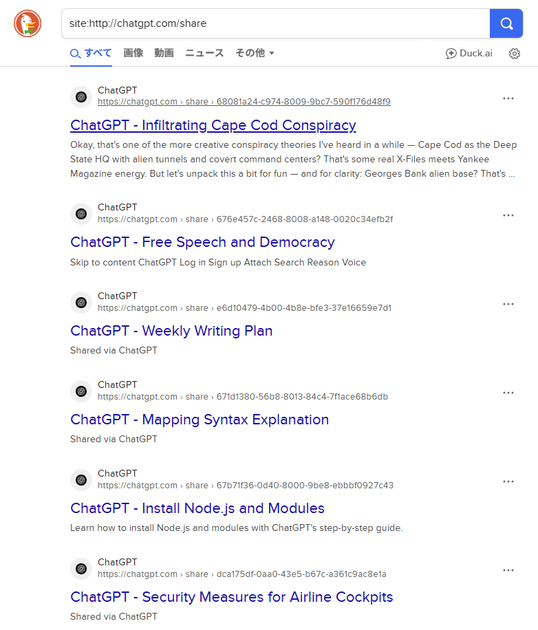

# Dork Watcher - Google Hacking支援ツール


**Day020 - 生成AIで作るセキュリティツール100**

**Dork Watcher**は、Google Dorkを使って自サイトに潜在的な情報漏洩がないか確認するためのツールです。

---

## 🔍 デモページ

👉 [https://ipusiron.github.io/dork-watcher/](https://ipusiron.github.io/dork-watcher/)

---

## 📸 スクリーンショット

> 
>
> *Dork一覧表示*

---

## 🕵️ Google Hacking

**Google Hacking（グーグル・ハッキング）** とは、検索エンジン（主にGoogle）を使って、**意図せず公開されている機密情報や設定ミス、脆弱なファイルなどを探し出す手法** です。  
これは悪用を目的とした攻撃手法としてだけでなく、セキュリティ診断やOSINT（オープンソース情報収集）においても正当な目的で活用されます。  

---
## ❓ Dorkとは？

このときに使われる検索クエリが、いわゆる **Google Dork（グーグル・ドーク）** です。

**Dork（ドーク）** とは、検索オプション（例：`filetype:`, `inurl:`, `intitle:` など）を組み合わせて、特定の情報を効率的に探すための検索式のことです。

この言葉には皮肉を込めた由来があります：

> 「こんなものを公開したままにしているなんて、まぬけ（dork）だ」

実際、セキュリティ研究者であるJohnny Long氏は2002年に[Google Hacking Database (GHDB)](https://www.exploit-db.com/google-hacking-database)を公開し、数千件以上のDorkを体系化しました。
現在でもセキュリティ教育・調査・CTFなどにおいて活用されています。

本ツール「Dork Watcher」は、このようなGoogle Dorkを使って、**自分の管理するサイトに潜在的なリスクがないかを簡易的にチェックする** ための支援ツールです。

### 💡 他の検索エンジンでも使えるか

Dorkは「Google Dork」と呼ばれていますが、DuckDuckGo（DDG）やBingなど他の検索エンジンでも一部構文は有効です。  
ただし、インデックスされる内容・件数・精度は異なるため、検出できる情報の傾向も変わります。

2025年8月のニュースでは、ChatGPTの共有リンク（Share link）機能を使ったページがDuckDuckGoに大量インデックスされたという出来事が報じられました。
たとえば、以下のDorkによって、インデクスされた共有リンクを列挙できました。

```
site:http://chatgpt.com/share
```

> 
>
> *DuckDuckGoでChatGPT共有リンクを検索したところ*

DuckDuckGoのほうが早く・多く・長期間にわたりそれらを表示してしまい、プライバシー重視のはずの検索エンジンが皮肉にも「最大の漏洩源」になってしまったのです。
これはDuckDuckGoのインデックスポリシーとクロールの緩さが原因によります。

| 比較項目        | Google   | DuckDuckGo   |
| ----------- | -------- | ------------ |
| Dork構文のサポート | ◎（完全）    | ◯（基本構文のみ）    |
| インデックス精度    | ◎（最大規模）  | △（Bingベース）   |
| 漏洩検出性能      | 高（除外も多い） | 中（削除が遅れる）    |
| プライバシー配慮    | 検索履歴あり   | ✅ 検索履歴を保存しない |

---

## 🧰 主な機能一覧

- Google Dork一覧自動生成（TOP30以上に対応）
- カテゴリー・リスクレベルによる複合フィルタリング
- 検索リンクのワンクリック生成（Googleで即調査）
- ヘルプモーダル（使い方・注意点をわかりやすく案内）
- ダークモード切り替え対応
- 結果件数のリアルタイム表示

---

## 🔧 フィルター機能

Dork Watcherでは、複数のDorkクエリの中から、必要なものだけを絞り込んで表示するためのフィルター機能を搭載しています。

### 📂 カテゴリー別フィルター
Dorkは以下の4つのカテゴリーに分類されています：

- **ファイル漏洩**：`.env`や`.sql`などの重要ファイルが誤って公開されていないか
- **管理系**：ログインページや管理画面の露出を検出
- **情報ワード**：パスワードやAPIキーなど、内部情報の含有可能性があるもの
- **その他**：ディレクトリリスティング、テストページなど

### ⚠️ リスクレベルフィルター
各Dorkには危険度に応じたリスクレベル（High / Medium / Low）が設定されており、絞り込みが可能です：

- **High**：機密情報の漏洩に直結する可能性が高い  
- **Medium**：セキュリティ上の注意が必要な情報  
- **Low**：一般的だが確認が推奨される情報

### 🔁 複合フィルターも可能
カテゴリーとリスクの両方を同時に指定することで、たとえば  
「ファイル漏洩」かつ「Highリスク」のDorkだけを表示といった絞り込みも可能です。

選択順に依存せず常に同一結果が得られるよう設計されており、  
「カテゴリー → リスク」でも「リスク → カテゴリー」でも整合性が保たれます。

---

## ⚠️ ご利用にあたっての留意事項

本ツールは「Google Dork」を用いて、**意図しない情報公開が行われていないかを確認する支援** を目的としています。

ただし、以下の点にご留意ください。

- 🔍 **多くのケースでは、検索してもヒットしないのが正常です。**  
  セキュリティ意識の高いサイトでは、漏洩につながるファイルや情報は適切に非公開化されています。  
  また、Google自体もセキュリティの観点から、以下のような 検索結果の制限・除外を行っています：

  - `robots.txt` や `noindex` 指定があるページの除外  
  - `.git` や `.env`、`passwd` など、意図しない機密ファイルへの直接リンクの除外  
  - ユーザー報告や自動検出に基づくインデックス削除

- 🔁 **Google検索の仕様は随時変更されています。**  
  かつて有効だったDork（例：`intitle:"index of"`、`inurl:admin` など）が現在では効果を発揮しにくいこともあります。  
  また、複雑な検索式や自動化されたクエリが繰り返されると、GoogleからBOTとして検出されてしまい、一時的に検索制限がかかることもあります。

- 📄 **「password」など一般的なキーワードはノイズを多く含みます。**  
  実際のパスワード漏洩ではなく、ブログ記事・マニュアル・セキュリティ解説などのページがヒットすることがあります。

- 🛡 **ヒットしないことは「安全」の証とは限りません。**  
  Googleにインデックスされていない領域（たとえば認証付きページや、検索エンジンブロック設定）に、漏洩情報が存在している可能性もあります。

- 🧪 **このツールはあくまで簡易的なチェックツールです。**  
  網羅的な脆弱性診断やペネトレーションテストの代替にはなりません。  
  より詳細な調査が必要な場合は、専門の診断サービスやOSINTツールの利用をご検討ください。

- 🧭 **調査対象は、自分の管理下にあるドメインや許可を得たサイトに限定してください。**  
  他人のサイトに対する情報収集やDork検索を行うことは、不正アクセス行為やプライバシー侵害に該当する可能性があります。

---

## 📄 ライセンス

MIT License - 詳細は [LICENSE](LICENSE) をご覧ください。

---

## 🛠 このツールについて

本ツールは、「生成AIで作るセキュリティツール100」プロジェクトの一環として開発されました。 このプロジェクトでは、AIの支援を活用しながら、セキュリティに関連するさまざまなツールを100日間にわたり制作・公開していく取り組みを行っています。

プロジェクトの詳細や他のツールについては、以下のページをご覧ください。

🔗 [https://akademeia.info/?page_id=42163](https://akademeia.info/?page_id=42163)
